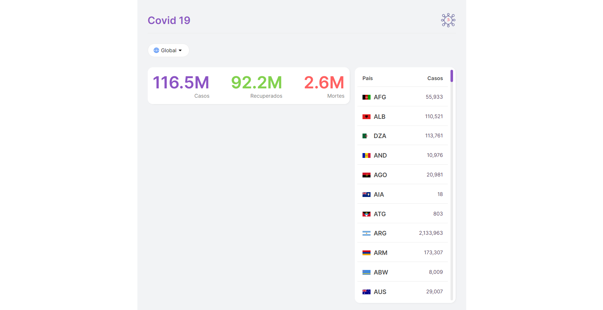
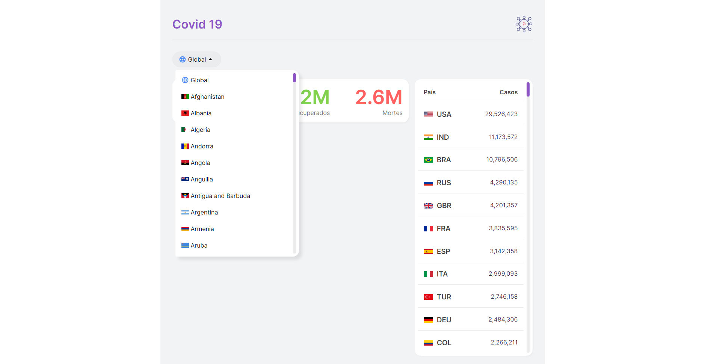
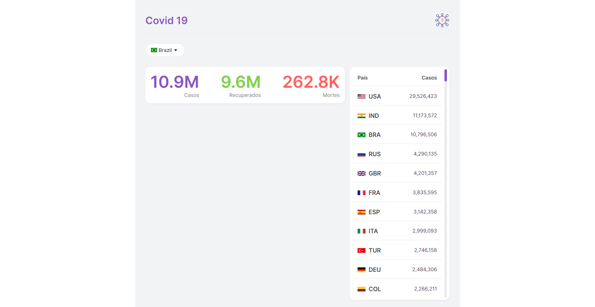

### Projeto em progresso...

Este projeto consiste em receber os dados universais do covid-19 providos pela API pública da [disiase.sh](https://disease.sh/),
e exibilos em tela.

Projeto com deploy feito na Vercel: [covid-lemon.vercel.app](https://covid-lemon.vercel.app/)

# Inicializando o projeto

Primeiramente instale as dependencias do projeto:

```bash
npm install
# ou
yarn install
```

Para rodar o projeto use o comando no terminal:

```bash
npm run dev
# ou
yarn dev
```
# Telas do projeto

 



# Tecnologias do projeto

- ReactJS
- NextJS

# Workflow do projeto

- [x] Criar os componentes e a estilização com **module.css**
- [x] Colocar as requisições da API no contexto global do app com **Context API**
- [x] Exibir menu lista de países
- [x] Exibir dados globais e do páis selecionado
- [x] Exibir ranking dos países classificando por numero de casos
- [ ] Adicionar gráfico ao projeto.
